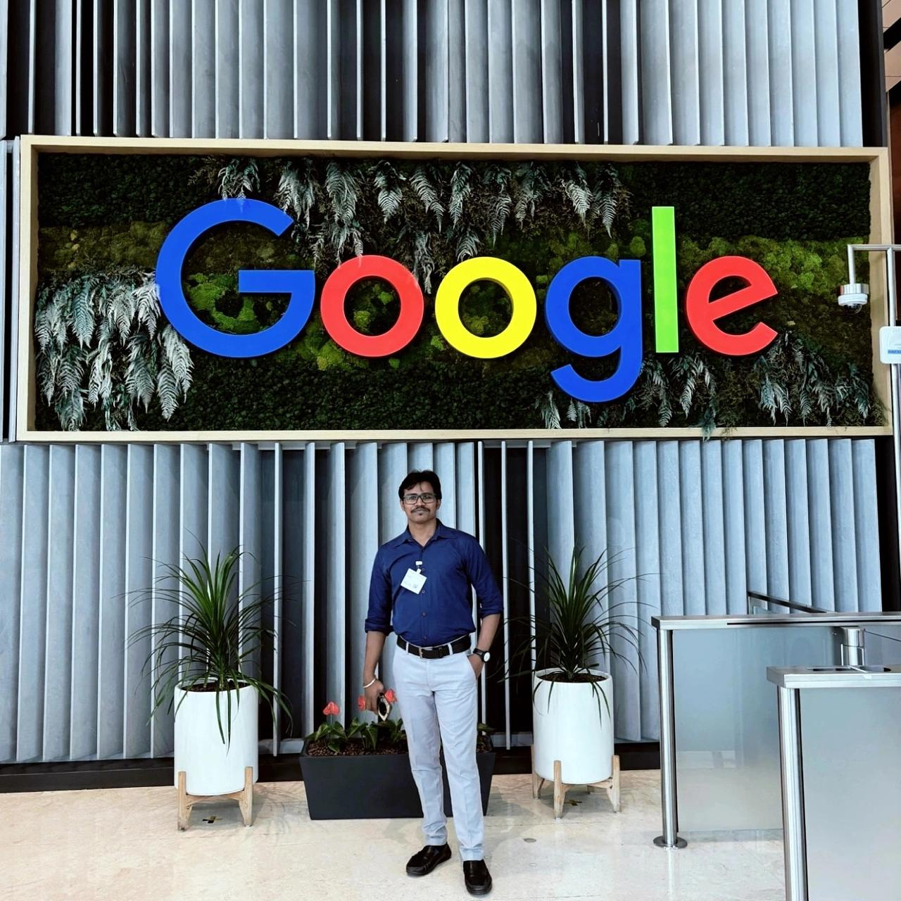

# **Basudev Ghadai - AI Fullstack Developer Portfolio**

AI Fullstack Developer | Python Developer | AWS & GenAI Specialist

# **About Me**

I'm Basudev Ghadai, an AI Fullstack Developer based in Odisha, India, currently working at Aimplify in Bengaluru. I specialize in designing and deploying cloud-native AI applications using cutting-edge technologies like Python, FastAPI, LangGraph, and Model Context Protocol (MCP).

As an AWS Certified AI Practitioner, I bring expertise in integrating LLM-powered systems, vector databases, and multi-agent architectures to build scalable, intelligent solutions that drive real-world automation and insights.

## **Connect with Me**

- **GitHub**: [basudevghadai1999](https://github.com/basudevghadai1999)
- **LinkedIn**: [Basudev Ghadai](https://www.linkedin.com/in/basudev-ghadai-67b07b200/)
- **Email**: ghadaibasudev1234@gmail.com

## **Technical Skills**

- **AI & LLM Development**: FastAPI, LangGraph, LangChain, LlamaIndex, MCP, Multi-agent orchestration
- **Cloud Platforms**: AWS (Elastic Beanstalk, ECS, App Runner, Lambda, S3, SageMaker, Bedrock), GCP (Vertex AI)
- **Backend Development**: Python, FastAPI, Django, Flask, RESTful APIs, Microservices
- **Databases**: MongoDB, PostgreSQL, Pinecone, Weaviate
- **AI Tools**: OpenAI APIs, Vertex AI, AWS Bedrock, Prompt Engineering
- **DevOps**: Docker, Git, CI/CD pipelines

---

**Built with Once UI's Magic Portfolio**

Original template by [Once UI](https://once-ui.com)  
Localization added by [François Hernandez](https://github.com/francoishernandez)

